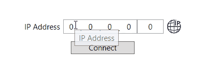
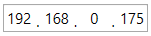
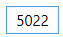
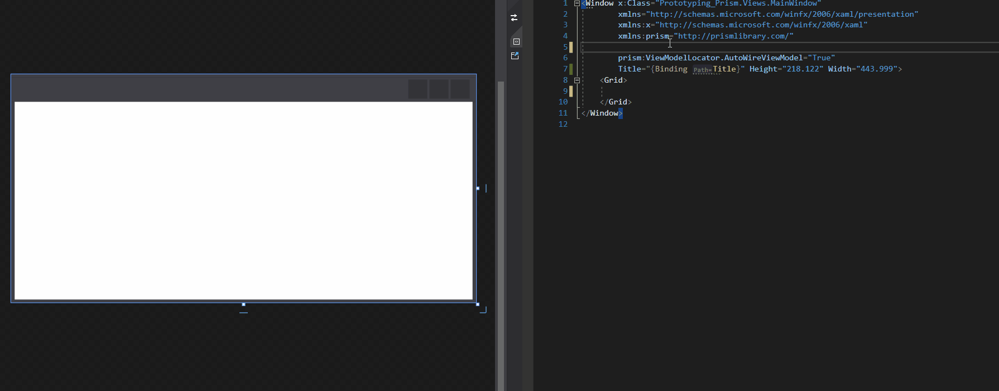

# IPUserControls.Wpf
 With these controls you get an IP Address Text Box, IP Port Text Box and IP Connection Status Icon. These are all seperate controls to allow you to place them however you want. Combine them together for a complete IP connection control.
 

 
## Controls Included
| **Controls**  | **Description**      | Bindable Property   |
| ------------- |----------------------| ------------------- | 
| IpField       | IP Address TextBox   | string or byte[]    |
| IpPort        | IP Port TextBox      | ushort              |
| IpStatus      | IP Connection Status | Connection Status   |

 
 
## Usage
1. Install the [IPUserControls](https://www.nuget.org/packages/IPUserControls.Wpf/1.1.0#) Nuget package
2. Add this to your _SomeView.xaml_ namespace
    ```xaml
    xmlns:ip="clr-namespace:IPUserControls;assembly=IPUserControls.Wpf"
    ```
3. Access the IP controls by typing either or all of the commands
   
   ```xaml
    <ip:IpField />
    ```
   
    
    ```xaml
    <ip:IpPort />
    ```
    
 
    ```xaml
    <ip:IpStatus />
    ```
    
    
4. Setting up the View in XAML shown below. I use Prism and an MVVM design. For an example on how to bind to the ViewModel, see the [Prototyping Prism](https://github.com/mariugul/IPUserControls/tree/main/Prototyping%20Prism) project in this repository. It does basic binding to get the IP, Port and set connection status.


   
